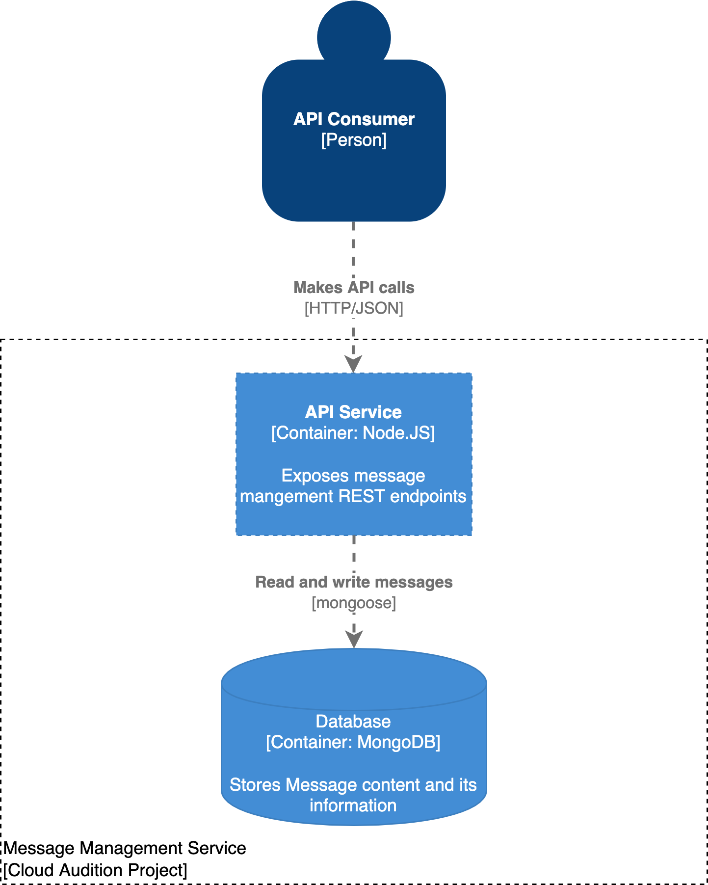

# Cloud Audition Project

## Introduction
In this project, a sample microservice is developed in Node.JS, which manages *messages* and provides details about those *messages*, specifically whether or not a message is a palindrome. This microservice uses MongoDB database for storing messages and it is packaged using docker. 

## Table of Contents

- [Cloud Audition Project](#cloud-audition-project)
  - [Introduction](#introduction)
  - [Table of Contents](#table-of-contents)
  - [High-level features](#high-level-features)
  - [Architecture](#architecture)
  - [Prerequisites](#prerequisites)
  - [Commands](#commands)
  - [Environment Variables](#environment-variables)
  - [Project Structure](#project-structure)
  - [API Documentation](#api-documentation)
    - [API Endpoints](#api-endpoints)
  - [Future scope](#future-scope)

## High-level features

- **NoSQL database**: [MongoDB](https://www.mongodb.com) object data modeling using [Mongoose](https://mongoosejs.com)
- **Validation**: request data validation using [express-json-validator-middleware](https://github.com/simonplend/express-json-validator-middleware)
- **Testing**: unit and integration tests using [Mocha](https://mochajs.org)
- **CI**: with `github actions`
- **Docker support**
- **Code coverage**: using [nyc](https://github.com/istanbuljs/nyc)
- **Code quality**: with [ESLint](https://eslint.org)
- **API documentation**: with [swagger-jsdoc](https://github.com/Surnet/swagger-jsdoc) and [swagger-ui-express](https://github.com/scottie1984/swagger-ui-express)

## Architecture


> Architecture image created using https://c4model.com/

## Prerequisites

- Node.JS > 12.0.0
- Docker Desktop (for Mac and Windows) / Docker Engine (for Linux)
  
## Commands

Testing:

```shell
# run all tests
npm run docker:test
```

To run locally:

```bash
npm run docker:dev
```

Linting:

```bash
# run ESLint
npm run lint

# fix ESLint errors
npm run lint:fix
```

Cleanup:

```bash
docker-compose down
```

## Environment Variables

The environment variables can be found in the `.env` file. Following environment variables are defined:

```bash
# Port number
PORT=3000
```

## Project Structure

```
src\
 |--config\         # configurations
 |--controllers\    # Route controllers (controller layer)
 |--docs\           # Swagger files
 |--middlewares\    # Custom express middlewares
 |--models\         # Mongoose models (data layer)
 |--routes\         # Routes
 |--services\       # Business logic (service layer)
 |--utils\          # Utility classes and functions
 |--validations\    # Request data validation schemas
 |--app.js          # Express app
 |--server.js       # App entry point
```

## API Documentation

To view the list of available APIs and their specifications, run the server and go to `http://localhost:3000/v1/docs` in your browser. This documentation page is automatically generated using the [swagger](https://swagger.io/) definitions written as comments in the route files.

### API Endpoints

`POST /v1/messages` - create a message\
`GET /v1/messages` - get all messages and associated information about messages\
`GET /v1/messages/:messageId` - get a message\
`PATCH /v1/messages/:messageId` - update a message\
`DELETE /v1/messages/:messageId` - delete a message

## Future scope

- Deployment on [minikube](https://minikube.sigs.k8s.io/docs/start/) for local testing
- CD pipeline
- Setup monitoring and alerting of service using [prometheus](https://prometheus.io/) and [grafana](https://grafana.com/)
- API security
- Load testing using [k6](https://k6.io/)
